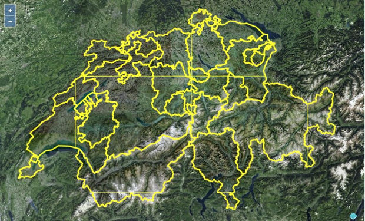

## 0.14.1 (2021-10-04)

#### Features

* Debian packages for bullseye and buster (thanks @tobwen)
* RPM package for CentOS/RHEL 8

#### Bug Fixes

* Fix reading 2D types from PostGIS geometries with Z or ZM dimensions
* Fix CORS headers (thanks @tobwen)
* Fix invalid geometries for some polygon simplifications

## 0.14.0 (2021-08-27)

#### Features

* Support for multiple geometry types in one layer
* Add `connection_timeout` configuration for PG connection pool
* Update to gdal 0.9.0 (Thanks @lnicola and @gerdos82!)
* Make `ST_MakeValid` in simplification optional (`make_valid`)
* Improved error messages for GDAL datasources
* Update Windows MSI to GDAL 3.3.2

#### Bug Fixes

* Fix clipping rectangle for non 256 pixel tiles
* Fix infinite seeding after connection timeout

#### Breaking changes

* Same simplifcation as in 0.11 is applied, when `make_valid` is not set.

## 0.13.0 (2021-02-19)

#### Features

* Automatic parallelization of tile seeding (`t_rex generate`)
* Add support for S3 tile storage (Thanks @arbakker!)
* Add optional extent SRID parameter in generate command (Thanks @arbakker!)
* Update to Maputnik 1.7.0
* Update to rust-postgres 0.19

## 0.12.0 (2020-12-26)

#### Features

* Support for PG connection with sslmode=require (Thanks @arbakker and @Daan-!)
* Support for HTTP HEAD requests (Thanks @sebastian-r-schmidt!)
* Return detailed config template error message (Thanks @arbakker!)
* Return projection in TileJSON (Thanks @lnicola!)
* Update to Actix-Web 3.0 (Thanks @lnicola!)
* Update to rust-postgres 0.17 (Thanks @lnicola and @WouterVisscher!)

#### Bug Fixes

* Avoid line artefacts in polygon simplification (Thanks @arbakker!)
* Force compatible WGS84 axis order with GDAL 3

## 0.11.0 (2020-06-25)

#### Features

* Zoom level dependent simplify configuration
* Support postgres varchar[] data type (Thanks @Blesss!)
* Update to async/await with Actix-Web 2.0

## 0.10.1 (2020-02-20)

#### Bug Fixes

* Don't flip Y for Non-Mercator grids when seeding cache (use TMS instead of XYZ)
* Fix interference of some static URLs with tile URLs
* Add fonts.json endpoint as requested by Maputnik

## 0.10.0 (2019-08-04)

#### Features

* [Template](https://tera.netlify.app/docs/#templates) support in configuration files
* Load environment variables from a file named `.env` in the current directory
  or any of its parents
* Initialize service only once before starting HttpServer threads
* Share DB connection pool between all HttpServer threads
* Migrate web server to Actix web 1.0

#### Bug Fixes

* Fix SQL queries for non-unique layer names
* Skip tile requests with z > grid.maxzoom
* Respect webserver threads configuration (broken since 0.9.0)

#### Breaking changes

* Environment variable expansion `${VARNAME}` is not supported anymore.
  Use `{{env.VARNAME}}` instead.
* `TREX_DATASOURCE_URL` is not automatically applied anymore.
  Use `dbconn = "{{ env.TREX_DATASOURCE_URL }}"` instead.

## 0.9.3 (2019-06-09)

#### Features

* New option `shift_longitude` for applying `ST_Shift_Longitude` to (transformed) bbox

#### Breaking changes

* `ST_Shift_Longitude` not applied by default for WGS 84 geometries

## 0.9.2 (2019-04-27)

#### Features

* Support option `detect-geometry-types` in `genconfig` command
* Support GDAL M- and ZM-geometry types

#### Bug Fixes

* Avoid duplicated fid_field in attributes
* Prevent invalid geometries by filtering repeated points
  and check for minimum number of points (Thanks @nimix!)
* Adjust Mercator grid resolutions to avoid negative coordinates instead of 0.0

## 0.9.1 (2018-11-14)

#### Features

* New cache_limits option (Thanks @apzel!)
* New simplification tolerance option (Thanks @apzel!)
* Support environment variables in configuration file
* Update Maputnik to 1.5
* Update viewer (mapbox-gl 0.51, OL 5.3.0)
* Add support for GDAL 25D geometry types
* Add support for GDAL network adresses like GeoJSON services
* Use internal implementation for converting WGS84 extents to Web Mercator
* Add CORS headers for index.json and static_file_handler

#### Bug Fixes

* Better panic messages for PostGIS driver errors
* Fix build with OpenSSL v1.1.1

## 0.9.0 (2018-07-24)

#### Features

* Port to asynchronous actix web framework
* New mode `no-transform` to pretend grid SRS
* New `drilldown` command and service for tileset statistics
* Configurable directories for static file serving
* Add support for PostGIS Compoundcurve and Curvedpolygon
* New option `detect-geometry-types` for disabling geometry detection
* New command line parameter `loglevel`
* Make `ST_MakeValid` on geometries before clipping optional (`make_valid`)
* Return 204 No Content for empty tiles
* `minzoom`/`maxzoom`, `center` and `start_zoom` configuration on tileset level (Thanks frodrigo!)
* Min-/maxzoom limits for tileset are deduced from layer/query limits
* New attribution configuration (Thanks frodrigo!)

#### Bug Fixes

* Support table names with special characters
* Omit empty layers in tiles (Thanks @frodrigo!)
* Return uncompressed tiles if requested

#### Breaking changes

* Serve and seed commands don't deliver/cache tiles out of tileset min-/maxzoom limits
* Empty tiles are not stored to cache anymore
* `ST_MakeValid` is not applied by default anymore. Set `make_valid true` to reactivate.

## 0.8.2 (2018-04-18)

#### Features

* Implement layer_extent for GDAL, make SRID optional (Thanks @lnicola!)
* Use tileset extent when generating cache (Thanks @lnicola!)
* Update to rust-postgis 0.6.0 with support for Geometry
  and GeometryCollection (Thanks @kestred!)

#### Bug Fixes

* Fix scrolling issues in t-rex-viewer (Thanks @OSHistory!)

## 0.8.1 (2017-10-05)

#### Features

* Read layers from QGIS project file

#### Bug Fixes

* Fix extent calculation for reprojected OGR geometries

## 0.8.0 (2017-09-26)

#### Features

* Support for GDAL/OGR datasources (up to 84 drivers, see http://gdal.org/)
* Multiple datasources in tilesets
* Configurable layer tile size
* Options `bind` and `port` for `serve` command
* New package formats: Deb package for Ubuntu, MSI for Windows and Docker image
  for all platforms

#### Breaking changes

* Changed configuration format of datasources

  See [Upgrading](https://t-rex.tileserver.ch/doc/setup/#0-7-x-0-8-0) for conversion help.
* User defined grid now in [grid.user] block
* Changed user defined grid units to lower case (m, dd, ft)

## 0.7.8 (2017-08-05)

#### Features

* Support for PostgreSQL SSL connections
* Serve fonts in pbf format

## 0.7.7 (2017-07-14)

#### Bug Fixes

* Fix queries with `!zoom!` variable
* Fix queries for layers with minzoom > 0

#### Breaking changes

* Use OGC SLD pixel size for `scale_denominator` calculation (like Mapnik)

## 0.7.6 (2017-07-10)

#### Features

* Use tileset extent from configuration as default for cache generation
* Serve fontstacks.json (used by Maputnik et al.)

#### Bug Fixes

* Fix queries at maxzoom levels

#### Breaking changes

* Extent parameter of generate command is now in WGS84 instead of grid SRS

## 0.7.5 (2017-06-26)

#### Bug Fixes

* Fix tileset extent detection of empty tables

## 0.7.4 (2017-06-25)

#### Features

* Tileset extent detection and configuration
* New seeding option `overwrite` (Thanks @kiambogo!)
* cache_control_max_age setting (with new default 0)
* Write :tileset.json and and :tileset.style.json when generating cache

## 0.7.3 (2017-06-15)

#### Features

* Update built-in Mapbox GL viewer to 0.38.0
* Open backend URL in browser when starting server
* Add support for the environment variable TREX_DATASOURCE_URL to
  override the datasource.url config field (Thanks @kiambogo!)
* Serve favicon
* Emit info message when features are limited by `query_limit`

#### Bug Fixes

* Turn off HTTP keep alive to avoid missing tiles in browser
* Fix WGS84 grid definition (Thanks @Wykks!)

#### Breaking changes

* Use `buffer_size` instead of `buffer-size` in config

## 0.7.2 (2017-06-08)

#### Features

* Change file cache scheme from TMS to XYZ
* Extend Web Mercator grid to level 22
* Limit features per tile to 1000 by default

#### Bug Fixes

* Fix TileJSON compatibility
* Fix generation of zoom levels greater than maximal grid zoom level

## 0.7.1 (2017-04-01)

#### Features

* Embedded [Maputnik](https://github.com/maputnik/editor) style editor
* Service Info page with viewer code snippets 

#### Bug Fixes

* Fix `generate` command with `extent` option

## 0.7.0 (2017-03-12)

#### Features

* Inline Mapbox GL (TOML) styles

#### Bug Fixes

* Extent and zoom calculation fixes (Thanks @rory and @joostvenema!)

## 0.6.1 (2016-11-22)

#### Features

* Support for PostgreSQL Unix socket connections
* Mac OS X build

#### Bug Fixes

* Fix integer overflows in grid calculations and MVT encoding

## 0.6.0 (2016-11-07)

#### Features

* New viewer with inlined OpenLayers and Mapbox GL libs
* User defined grids

#### Bug Fixes

* Fix clipping and simplification with reprojected geometries

## 0.5.0 (2016-10-25)

#### Features

* Experimental Mapbox GL Style Json output

#### Bug Fixes

* Support for Multi-Geometries (Multipoint, Multiline, Multipolygon)

## v0.4.0 (2016-09-11)

#### Features

* Tile cache generation command
* Improved polygon simplification

## v0.3.1 (2016-09-06)

#### Bug Fixes

* Support for database column names which have a colon 
* TileJSON center value format fixed

## v0.3.0 (2016-09-05)

#### Features

* Simplify option
* Experimental clipping support

## 0.2.0 (2016-08-30)

#### Features

* Automatic column type conversion
* Transform geometries to grid SRS
* Pre-build SQL queries

## 0.1.0 (2016-08-17)

First Release
